# Network Security Report

## Phase 1 — Baseline Chat Application

### 1. System Overview

The Phase 1 implementation consists of two programs:

* `server.cpp` — implements the central chat server.
* `client.cpp` — implements the client application.

The server listens for TCP connections on **port 1111** and acts as an intermediary between connected clients. Clients communicate with each other by sending messages through the server.

The implementation was tested using **separate physical laptops connected to the same network**. One laptop was used as the server and two other laptops were used as clients.

### 2. System Architecture

The communication follows the following architecture:

```text
                    TCP : 1111

       ┌──────────────┐       ┌──────────────┐
       │   Client 1   │       │   Client 2   │
       │      C1      │       │      C2      │
       └──────┬───────┘       └──────┬───────┘
              │                      │
              │        TCP           │
              │                      │
              └──────────┬───────────┘
                         │
                  ┌──────▼───────┐
                  │    Server    │
                  │      S       │
                  └──────────────┘
```

The server maintains the connected clients and forwards messages to their intended recipients.

### 3. Server Implementation

The server creates a TCP socket, binds it to port `1111`, and listens for incoming connections.

For every new connection, the server creates a separate thread:

```cpp
std::thread clientThread(handleClient, clientSocket);
clientThread.detach();
```

This allows multiple clients to remain connected and communicate concurrently.

The server maintains a mapping between usernames and their corresponding socket descriptors:

```cpp
std::unordered_map<std::string, int> clients;
```

For example:

```text
client1 → socket descriptor
client2 → socket descriptor
```

A mutex protects this shared mapping because it can be accessed by multiple client-handling threads simultaneously.

### 4. Message Routing

Messages are addressed using the format:

```text
@username message
```

For example:

```text
@client2 Hello from client1
```

The client extracts the destination username and sends the message to the server. The server searches for that username in its client map and forwards the message to the corresponding socket.

The server also logs successfully relayed messages. For example:

```text
[CHAT] client1 -> client2 : Hello from client1
```

This confirms that the server has access to the complete message contents in plaintext.

### 5. Client Commands

The client supports the required basic commands:

```text
@username message
/chat username
/who
/quit
```

The `/chat` command sets the current chat partner, allowing subsequent messages to be sent without repeatedly specifying the username.

The `/who` command requests the list of currently connected users from the server, while `/quit` terminates the connection cleanly.

### 6. Plaintext Verification

Since Phase 1 does not implement encryption, messages are transmitted directly over TCP as plaintext.

The server-side logs demonstrate that the server can read the message contents.

Additionally, the traffic was captured using **Wireshark**. The TCP conversation was inspected using **Follow → TCP Stream**, where the actual chat messages could be observed directly.

**Figure 1: Wireshark TCP Stream showing plaintext communication**

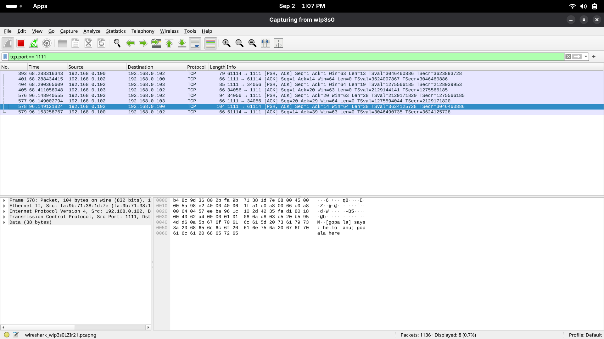

The capture confirms that an observer capable of monitoring the network traffic can read the exchanged messages without requiring any decryption.

### 7. Phase 1 Result

The Phase 1 chat application was successfully implemented and tested with two simultaneous clients.

The implementation provides functional client-to-client messaging through the server, username-based routing, online-user discovery, and clean disconnection.

However, all communication is currently plaintext. This establishes the insecure baseline that will be improved in the subsequent phases by introducing cryptographic protection.


# Phase 2 — Client-Server Confidentiality via Diffie–Hellman

## 1. Overview

Phase 2 introduces confidentiality to the Phase 1 chat application using a Diffie–Hellman (DH) key exchange followed by AES-256-GCM encryption.

The DH exchange is implemented manually using OpenSSL's low-level `BIGNUM` operations and modular exponentiation. No built-in DH/ECDH implementation is used.

Each client establishes a separate DH shared secret with the server. The resulting shared secret is then hashed using SHA-256 to derive a 256-bit AES key.

The resulting architecture is:

```text
       Client 1                         Server
          │                               │
          │────── DH Key Exchange ───────►│
          │                               │
          │◄───── DH Key Exchange ────────│
          │                               │
          │       Shared Secret           │
          │       ↓                       │
          │      SHA-256                  │
          │       ↓                       │
          │     AES-256 Key               │
          │                               │
          │════ Encrypted Communication ══│


       Client 2                         Server
          │                               │
          │────── DH Key Exchange ───────►│
          │                               │
          │◄───── DH Key Exchange ────────│
          │                               │
          │       Independent             │
          │       Shared Secret           │
          │       ↓                       │
          │      SHA-256                  │
          │       ↓                       │
          │     AES-256 Key               │
          │                               │
          │════ Encrypted Communication ══│
```

Thus, the server does not use a single key for all clients. Each client-server connection has its own independently derived key.

---

## 2. Diffie–Hellman Implementation

The DH functionality is implemented in `dh.cpp`.

The implementation uses the **RFC 3526 2048-bit MODP Group (Group 14)**. The generator is set to:

```cpp
BN_set_word(g, 2);
```

A private key is generated for each `DHE` instance:

```cpp
BN_rand_range(priv_key, p);
```

The corresponding public key is calculated using modular exponentiation:

```cpp
BN_mod_exp(pub_key, g, priv_key, p, ctx);
```

For a client and server, the exchange can be represented as:

```text
Client:
    private = a
    public  = g^a mod p

Server:
    private = b
    public  = g^b mod p

Client computes:
    (g^b)^a mod p

Server computes:
    (g^a)^b mod p
```

Both sides therefore obtain the same DH shared secret without transmitting the secret itself over the network.

---

## 3. Independent Key for Each Client

The server creates a new `DHE` object whenever a client connects:

```cpp
void handleClient(int clientSocket) {
    DHE dh;
    dh.generateKeys();
    ...
}
```

Since `handleClient()` executes independently for every connected client, each client receives a separate DH key exchange.

The server also stores the corresponding `DHE` object with the client's socket:

```cpp
struct ClientData {
    int socket;
    DHE* dh_ptr;
};
```

This allows the server to use the correct encryption key when sending a message to a particular client.

Conceptually:

```text
Client 1 ─────── Key K1 ─────── Server
Client 2 ─────── Key K2 ─────── Server

             K1 ≠ K2
```

This prevents the server from accidentally using the same symmetric key for different client connections.

---

## 4. Deriving the AES Key

The raw DH shared secret is not directly used as the AES key.

After computing the shared secret, it is converted into a fixed-length byte representation and hashed using SHA-256:

```cpp
EVP_DigestInit_ex(mdctx, EVP_sha256(), nullptr);
EVP_DigestUpdate(mdctx, secret_bytes.data(), secret_bytes.size());
EVP_DigestFinal_ex(mdctx, aes_key.data(), &hash_len);
```

The SHA-256 output is 32 bytes, giving a 256-bit AES key.

Therefore:

```text
DH Shared Secret
       │
       ▼
    SHA-256
       │
       ▼
  256-bit AES Key
```

Hashing the shared secret provides a fixed-length, uniformly represented key suitable for use with AES. It also avoids directly treating the mathematical DH value as a symmetric encryption key.

---

## 5. AES-GCM Encryption

After the DH exchange, subsequent communication is encrypted using **AES-256-GCM**.

For every message, a fresh 12-byte random nonce is generated:

```cpp
unsigned char nonce[12];

RAND_bytes(nonce, sizeof(nonce));
```

The plaintext is then encrypted using AES-256-GCM:

```cpp
EVP_EncryptInit_ex(
    ctx,
    EVP_aes_256_gcm(),
    nullptr,
    aes_key.data(),
    nonce
);
```

The resulting network payload contains:

```text
┌────────────┬──────────────┬─────────────────┐
│   Nonce    │ Authentication│   Ciphertext    │
│   12 bytes │   Tag 16 B    │                 │
└────────────┴──────────────┴─────────────────┘
```

The authentication tag is generated by GCM and is later used to verify that the ciphertext has not been modified.

This provides both confidentiality and integrity for the encrypted messages.

---

## 6. Encrypted Login and Chat Communication

Unlike Phase 1, the username exchange is also encrypted after the DH handshake.

The server encrypts its username prompt:

```cpp
std::vector<unsigned char> enc_prompt = dh.encrypt(prompt);
```

The client decrypts the prompt using the derived AES key.

Similarly, the username entered by the client is encrypted before being sent:

```cpp
std::vector<unsigned char> enc_username = dh.encrypt(username);
```

Normal chat commands such as:

```text
@client2 Hello
/who
/quit
```

are also encrypted before transmission.

Therefore, after the DH exchange, the application does not send the actual chat content as plaintext over the network.

---

## 7. DH Fingerprint Verification

To verify that both sides derived the same shared key, a hash-based fingerprint is generated.

The fingerprint is calculated from the derived AES key using SHA-256, and only the first eight bytes of the resulting hash are displayed.

For example:

```text
DH Fingerprint: cf5022078beb8bbe
```

The raw DH shared secret and AES key are never printed.

During testing, the fingerprint displayed by the client matched the fingerprint displayed by the server for the corresponding connection.

This demonstrates that both endpoints independently derived the same symmetric key.

**Figure 1: Matching DH fingerprints on client and server**

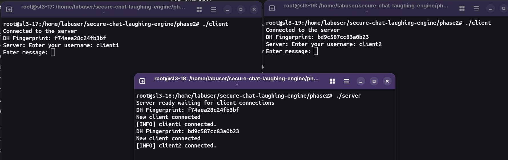

---

## 8. Wireshark Verification

The same traffic inspection performed in Phase 1 was repeated after introducing encryption.

The TCP traffic was captured using Wireshark on port `1111` and inspected using:

```text
Follow → TCP Stream
```

Unlike Phase 1, the actual chat message is no longer visible in plaintext.

Instead, the TCP stream contains binary-looking encrypted data corresponding to the nonce, authentication tag, and ciphertext.

**Figure 2: Wireshark capture showing encrypted Phase 2 traffic**

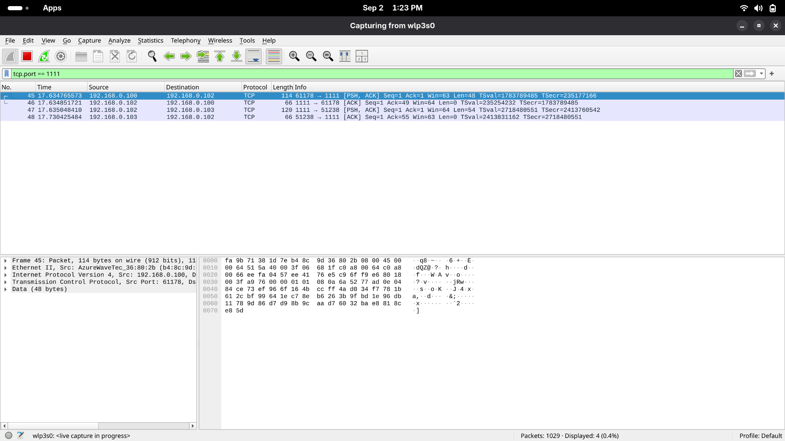

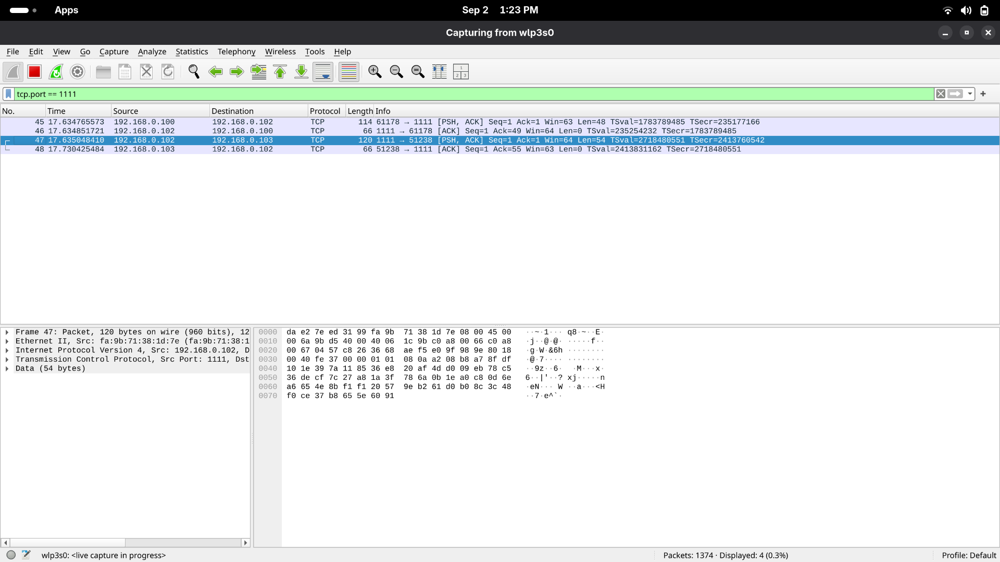

This demonstrates that a passive network observer can no longer directly read the application message from the captured TCP stream.

---

## 9. AES-GCM Tamper Detection

AES-GCM also provides authentication of the encrypted data.

To test this property, a single byte of the ciphertext was modified before attempting decryption.

The decryption function verifies the GCM authentication tag using:

```cpp
EVP_CIPHER_CTX_ctrl(
    ctx,
    EVP_CTRL_GCM_SET_TAG,
    16,
    tag
);
```

If the ciphertext has been modified, the authentication check fails:

```cpp
if (ret <= 0) {
    return "<DECRYPTION_FAILED_TAMPERING_DETECTED>";
}
```

Therefore, modified ciphertext is rejected instead of being silently decrypted into corrupted plaintext.

**Figure 3: AES-GCM tampering test**

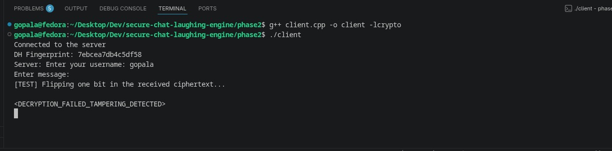

The observed result was:

```text
<DECRYPTION_FAILED_TAMPERING_DETECTED>
```

This confirms that the integrity protection provided by AES-GCM is functioning correctly.

---

# 10. Man-in-the-Middle Attack

Although Diffie–Hellman protects the communication from passive eavesdropping, the basic DH exchange does not authenticate the party on the other side.

To demonstrate this weakness, a separate `mitm.cpp` program was implemented.

The proxy establishes two independent DH exchanges:

```text
                    Mallory
               ┌────────────────┐
               │                │
       DH-1    │                │    DH-2
Client ◄──────►│     MITM       │◄──────► Server
               │                │
               └────────────────┘
```

Mallory therefore has:

```text
Client ↔ Mallory : Key K1

Mallory ↔ Server : Key K2
```

The client believes that it has established a secure key with the server, while the server believes that it has established a secure key with the client.

In reality, Mallory possesses both keys.

---

## 11. MITM Message Interception

The proxy decrypts messages received from the client using the client-facing key:

```cpp
std::string plaintext = dh_client->decrypt(payload);
```

The plaintext is then logged:

```cpp
std::cout << "\n[INTERCEPT C->S]: "
          << plaintext << std::endl;
```

Mallory subsequently encrypts the plaintext using the server-facing key and forwards it to the real server.

The same process is performed in the reverse direction.

Thus:

```text
Client
  │
  │ encrypted with K1
  ▼
Mallory
  │
  │ decrypt → plaintext
  │
  │ encrypt with K2
  ▼
Server
```

This allows Mallory to read the supposedly protected communication while still allowing the client and server to communicate normally.

**Figure 4: MITM proxy successfully intercepting plaintext**

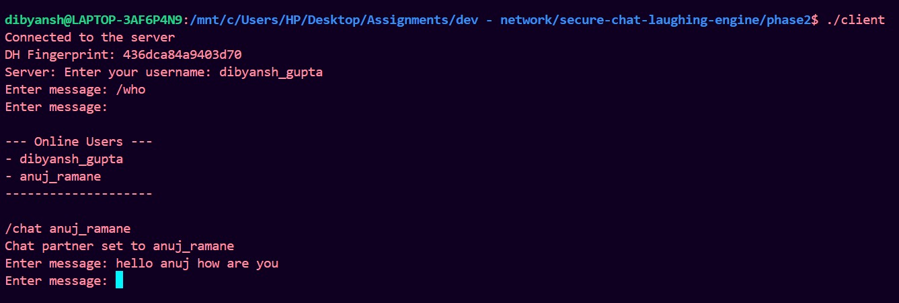

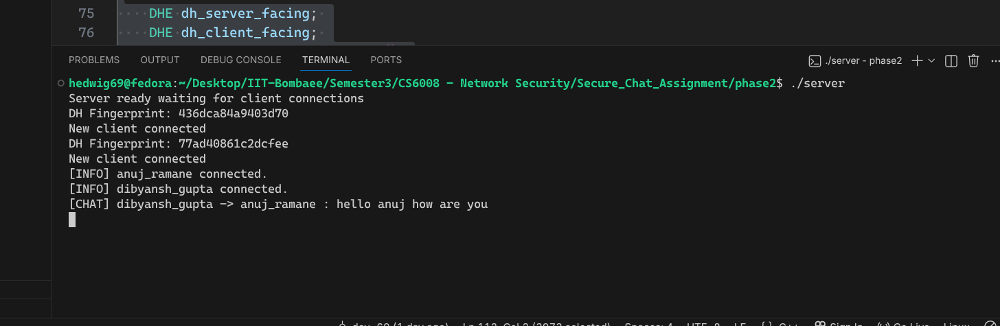

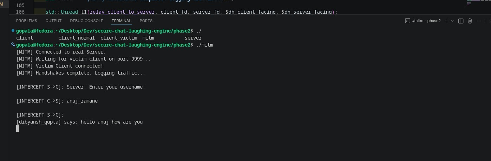

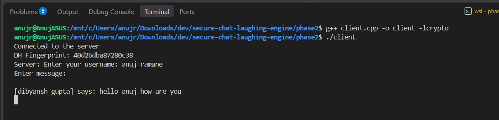

Example output:

```text
[MITM] Handshakes complete. Logging traffic...

[INTERCEPT C->S]: @client2 Hello from client1

[INTERCEPT S->C]: [client2] says: Hello from client1
```

This demonstrates that unauthenticated Diffie–Hellman alone does not provide protection against an active MITM attacker.

---

## 12. Phase 2 Result

Phase 2 successfully adds confidentiality and authenticated encryption to the client-server communication.

Each client independently performs a Diffie–Hellman exchange with the server, derives a shared secret, and converts that secret into a 256-bit AES key using SHA-256. Subsequent communication is protected using AES-256-GCM.

The matching DH fingerprints confirm that both endpoints derive the same key, while the Wireshark capture demonstrates that application messages are no longer visible as plaintext.

The AES-GCM tampering test further demonstrates that modification of encrypted data is detected.

However, the MITM experiment demonstrates an important limitation: **Diffie–Hellman by itself does not authenticate the identity of the peer**. Mallory can establish separate keys with the client and server and transparently relay decrypted messages between them.

This limitation motivates the authentication mechanism introduced in Phase 3.

# Phase 3 – Server Authentication via PKI

## Objective

The objective of Phase 3 is to authenticate the chat server using Public Key Infrastructure (PKI). The client validates the server certificate using a trusted Certificate Authority (CA) before proceeding with the Diffie-Hellman exchange.

The server also proves that it possesses the private key corresponding to the public key contained in the certificate.

---

## 1. Certificate Authority and Server Certificate Setup

A private Certificate Authority was created using OpenSSL. The CA consists of a private key and a self-signed root certificate.

The server key pair was then generated, followed by the creation of a Certificate Signing Request (CSR). The CSR was signed using the CA private key to generate the server certificate.

The main files generated are:

```text
certs/
├── ca.key
├── ca.crt
├── server.key
└── server.crt
```

The commands used were:

```bash
# Generate CA private key
openssl genrsa -out certs/ca.key 4096

# Generate self-signed CA certificate
openssl req -x509 -new -nodes \
    -key certs/ca.key \
    -sha256 -days 3650 \
    -out certs/ca.crt \
    -subj "/C=IN/ST=Maharashtra/L=Mumbai/O=SecureChat/OU=CA/CN=SecureChat Root CA"

# Generate server private key
openssl genrsa -out certs/server.key 2048

# Generate server CSR
openssl req -new \
    -key certs/server.key \
    -out certs/server.csr \
    -subj "/C=IN/ST=Maharashtra/L=Mumbai/O=SecureChat/OU=Server/CN=SecureChat Server"

# Sign server CSR using the CA
openssl x509 -req \
    -in certs/server.csr \
    -CA certs/ca.crt \
    -CAkey certs/ca.key \
    -CAcreateserial \
    -out certs/server.crt \
    -days 365 \
    -sha256
```

### Screenshot – OpenSSL Certificate Generation

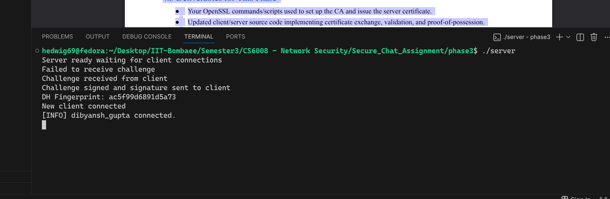

---

## 2. Updated Client and Server

The Phase 2 client and server were modified to implement certificate authentication.

### Certificate Exchange

Before performing Diffie-Hellman, the server sends its certificate to the client.

The client receives and parses the certificate using OpenSSL and validates it against its trusted copy of:

```text
certs/ca.crt
```

The client verifies that:

* The certificate is signed by the trusted CA.
* The certificate is within its validity period.
* The certificate is trusted by the client's CA store.

If validation fails, the client immediately closes the connection and does not proceed with the remaining handshake.

### Proof-of-Possession

After successful certificate validation, the client generates a random 32-byte challenge.

```text
Client → Server : Random Challenge
```

The server signs this challenge using:

```text
certs/server.key
```

The signature is sent back to the client.

The client extracts the public key from the validated server certificate and verifies the signature.

```text
Client → Server : Challenge
Client ← Server : Signature(Challenge)
Client       : Verify using certificate public key
```

Only after successful proof-of-possession does the client proceed with the Diffie-Hellman exchange.

### Screenshot – Legitimate Phase 3 Connection

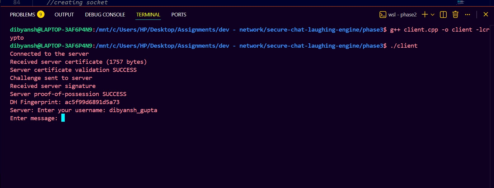

The screenshot should show:

```text
Received server certificate
Server certificate validation SUCCESS
Challenge sent to server
Received server signature
Server proof-of-possession SUCCESS
DH Fingerprint: ...
```

---

## 3. Updated MITM Attack

The Phase 2 MITM proxy was modified to attack the Phase 3 protocol.

Mallory generates a different certificate that is not signed by the trusted CA and sends it to the victim client.

The client receives Mallory's certificate and attempts to validate it using its trusted CA certificate.

Since Mallory's certificate is not signed by the trusted CA, certificate validation fails.

The client immediately terminates the connection.

The MITM therefore cannot continue to the Diffie-Hellman exchange.

### Expected Result

```text
[MITM] Sent Mallory certificate to victim.
[MITM] Waiting for victim to validate certificate...

SERVER CERTIFICATE VALIDATION FAILED
Reason: unable to get local issuer certificate
```

The MITM observes that the victim closes the connection.

### Screenshot – MITM Attack Failure

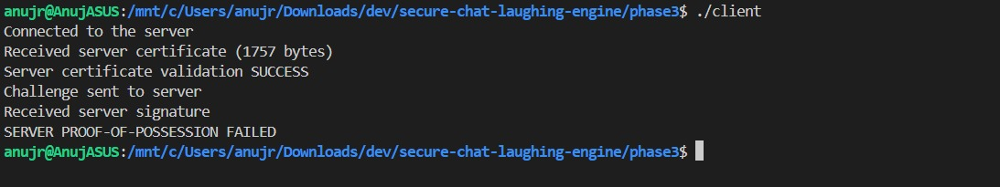

---

## 4. Proof-of-Possession Bypass Attempt

A second attack was performed where Mallory possesses a copy of the legitimate server certificate but does not possess the corresponding private key.

Mallory forwards the legitimate certificate to the client but signs the client's random challenge using a different private key.

The client verifies the signature using the public key contained in the legitimate server certificate.

Since Mallory's private key does not correspond to that public key, signature verification fails.

The client therefore rejects the connection.

### Expected Result

```text
Received server signature
SERVER PROOF-OF-POSSESSION FAILED
```

The MITM observes that the victim closes the connection.

### Screenshot – Proof-of-Possession Failure

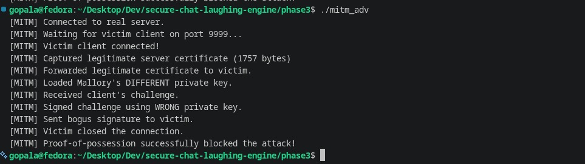

---


## 6. Final Result

Phase 3 successfully implements server authentication using PKI.

The final secure handshake is:

```text
Client
   │
   │ Connect
   ▼
Server
   │
   │ Server Certificate
   ▼
Client
   │
   │ Validate Certificate using Trusted CA
   │
   │ Random Challenge
   ▼
Server
   │
   │ Sign Challenge using Server Private Key
   ▼
Client
   │
   │ Verify Signature
   │
   │ ✓ Proof-of-Possession
   │
   │ Diffie-Hellman Exchange
   ▼
Encrypted Chat
```

The Phase 2 MITM attack is successfully prevented because an attacker cannot authenticate as the server without a certificate signed by the trusted CA and the corresponding server private key.


# Phase 4 — End-to-End Encryption Between Clients

## 1. Overview

Phase 4 adds an additional end-to-end encryption layer between clients.

When Client 1 executes:

```text
/e2e client2
```

Client 1 and Client 2 perform a separate Diffie–Hellman exchange directly at the application level. The server only relays the handshake messages and does not obtain the resulting shared key.

Once the E2E session is established, chat messages are encrypted using the client-to-client key before being sent through the existing encrypted client-server connection from Phase 3.

The resulting structure is:

```text
Client 1
   │
   │ E2E encryption
   ▼
E2E Ciphertext
   │
   │ Client-server encryption
   ▼
Server
   │
   │ Relay only
   ▼
Client 2
   │
   │ E2E decryption
   ▼
Plaintext
```

The server can still see routing information such as the sender and destination username, but it cannot derive the E2E key or decrypt the message content.

---

## 2. E2E Key Establishment

The `/e2e username` command triggers the client-to-client key exchange.

The protocol distinguishes E2E handshake messages from normal chat messages using tags such as:

* `__E2E_INIT__`
* `__E2E_ACK__`
* `__E2E_MSG__`

The server does not need to understand these messages cryptographically. It simply forwards them to the appropriate client.

After the exchange, both clients independently derive the same E2E key.

**Figure 10 — Matching E2E Fingerprints**

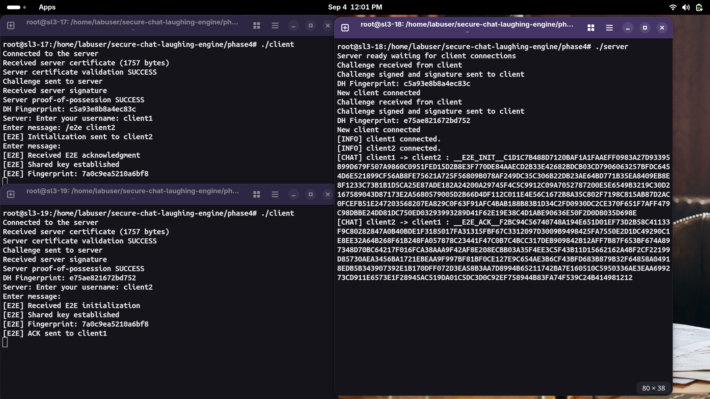

The matching fingerprints provide evidence that both clients derived the same E2E key.

---

## 3. End-to-End Message Encryption

After the E2E session is established, messages are encrypted using the client-to-client key and AES-GCM.

The resulting ciphertext is wrapped using `__E2E_MSG__` and sent through the already encrypted client-server connection.

The server therefore receives only opaque E2E ciphertext.

**Figure 11 — Server Relaying E2E Ciphertext**

*(Relayed ciphertext visible in server terminal logs shown in Figure 10 and Figure 12)*

The server can identify that `client1` is sending data to `client2`, but the actual message content is not visible.

For comparison, before an E2E session is established, the server can still read normal chat messages, consistent with the Phase 2/3 design.

---

## 4. End-to-End Verification

A test message was sent from Client 1 to Client 2 after establishing the E2E session.

The server log showed only the E2E ciphertext, while Client 2 successfully decrypted and displayed the original message.

**Figure 12 — E2E Message Successfully Decrypted**

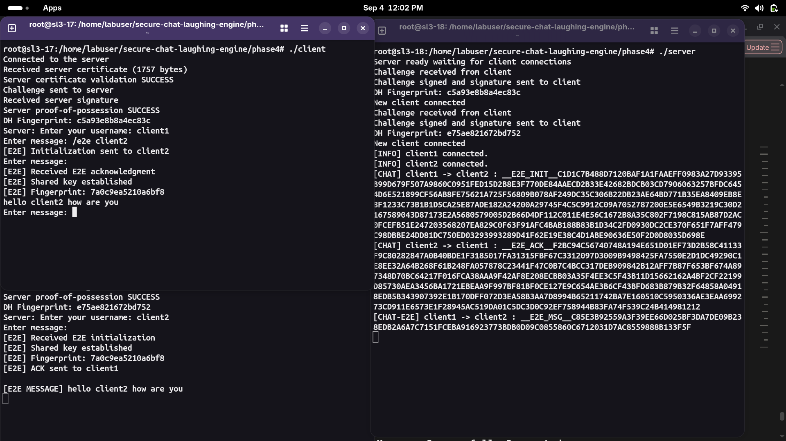

This confirms that:
* Client 1 and Client 2 successfully established a shared E2E key.
* The server could not read the E2E message content.
* The server continued to function purely as a relay.
* Client 2 could correctly decrypt the message.

---

## 5. Phase 4 Result

Phase 4 introduces an additional encryption layer between clients without replacing the existing client-server security from Phase 3.

The server continues to provide routing and transport, but it does not possess the client-to-client E2E key. The matching fingerprints demonstrate that the two clients independently derived the same key, while the server log demonstrates that E2E chat content is transmitted only as opaque ciphertext.

Thus, the confidentiality of messages is extended from client-server encryption to true client-to-client end-to-end encryption.


# Phase 5 — Forward Secrecy via Key Rotation

## 1. Overview

While Phase 4 provides end-to-end confidentiality between clients, it relies on a single, long-lived session key negotiated at connection time. If an adversary passively logs all encrypted network traffic over the wire and later compromises one of the endpoints (or extracts the key from memory), the adversary can retroactively decrypt all historical messages.

Phase 5 addresses this limitation by introducing **Forward Secrecy via periodic key rotation**. The shared symmetric key between Client 1 and Client 2 is automatically renegotiated on a fixed timer every 60 seconds. Each renegotiation produces a genuinely new, independent key, and the previous key is discarded and erased from memory.

---

## 2. Automatic Key Rotation Architecture

Key rotation is managed automatically by a dedicated background thread (`rekeyTimer`) running on each client:

```text
Client 1 (e.g. dev)                                  Client 2 (e.g. sanchit)
       │                                                    │
       │═══════════ Active E2E Session (Key K1) ════════════│
       │                                                    │
[60s Timer Expires]                                         │
       │                                                    │
       │───── __E2E_REKEY_INIT__ (Round 1 + New g^a) ──────►│
       │                                                    │
       │                                            [Computes Key K2]
       │                                                    │
       │◄──── __E2E_REKEY_RESPONSE__ (Round 1 + g^b) ───────│
       │                                                    │
[Computes Key K2]                                           │
[Wipes Old Key K1]                                          │
       │                                                    │
       │───── __E2E_REKEY_CONFIRM__ (Round 1 + FP) ────────►│
       │                                                    │
       │                                            [Wipes Old Key K1]
       │                                                    │
       │═══════════ Active E2E Session (Key K2) ════════════│
```

For every rotation cycle:
1. A fresh ephemeral Diffie–Hellman key pair is generated using RFC 3526 Group 14 (`new DHE()`, `generateKeys()`).
2. The public key is exchanged inside an encrypted control message relayed through the server.
3. Both clients compute the new shared secret, hash it with SHA-256 to derive a new 256-bit AES key, and verify matching fingerprints.
4. The previous key is securely wiped and freed from memory using `destroyDHE()`.

---

## 3. Forward Secrecy and Old Key Destruction

To guarantee forward secrecy, old keys must not persist in process memory. The `destroyDHE` function explicitly clears the OpenSSL `BIGNUM` private and public components using `BN_clear()`, zeroes out the raw AES symmetric key vector with `std::fill`, and frees the allocated memory:

```cpp
void destroyDHE(DHE*& dh) {
    if (dh != nullptr) {
        BN_clear(dh->priv_key);
        BN_clear(dh->pub_key);
        std::fill(dh->aes_key.begin(), dh->aes_key.end(), 0);
        delete dh;
        dh = nullptr;
    }
}
```

Once confirmation completes, the old session key is permanently erased from memory.

---

## 4. Collision Avoidance Mechanism

A critical challenge in decentralized rekeying is handling race conditions where both clients attempt to trigger renegotiation at approximately the same time. If both clients simultaneously send rekey initialization requests, they risk computing mismatched keys or deadlocking.

To resolve this, the protocol enforces a deterministic leader election based on lexicographical username comparison:

```cpp
if (localUsername >= e2ePartner) {
    return; // Only the client with lower username initiates rotation
}
```

By designating the client with `localUsername < e2ePartner` (e.g. `dev < sanchit`, where `dev` initiates rotation) as the authoritative rotation initiator, collisions are eliminated by design. If an unexpected rekey initialization arrives while one is already in progress, the lower-priority peer yields, drops its pending request, and answers the initiator's request.

---

## 5. Verification and Results

### 5.1 Successive Key Rotations (Fingerprints and Timestamps)

The chat application was deployed and verified across separate virtual machines:

* **Server VM (`server`):** `10.91.240.119:1111`
* **Client 1 VM (`client1`):** `10.91.240.136` (User: `dev`)
* **Client 2 VM (`client2`):** `10.91.240.179` (User: `sanchit`)

The verification demonstrated the following lifecycle across two full rotations:

* **Initial Handshake:** Both client VMs established the initial E2E session across the virtual network and printed matching fingerprints:
  <br>`[E2E] Fingerprint: 036f6ef30aa52e33`
* **Pre-Rotation Chat:** Client 1 (`dev`) transmitted `"Hello sanchit how are you ?"`, which Client 2 (`sanchit`) received and decrypted successfully.
* **60-Second Rotation (Round 1):** After 60 seconds, the background timer automatically triggered rotation. Both clients renegotiated keys and confirmed matching fingerprints at the exact same timestamp:
  <br>`[E2E] Key rotation completed at 2026-09-04 23:23:58 (Round 1)`
  <br>`[E2E] New fingerprint: c2d66cf834bb1a56`
* **60-Second Rotation (Round 2):** After another 60 seconds, the background timer triggered a second rotation. Both clients renegotiated keys again and confirmed matching fingerprints at the exact same timestamp:
  <br>`[E2E] Key rotation completed at 2026-09-04 23:24:58 (Round 2)`
  <br>`[E2E] New fingerprint: deff0e18ea3c60e3`

The fingerprints changed from `036f6ef30aa52e33` to `c2d66cf834bb1a56` to `deff0e18ea3c60e3`, proving across two successive rotations that:
1. The fingerprint changes each time (genuinely fresh ephemeral secrets).
2. Both clients agree on the exact same fingerprint after every rotation.

**Figure 13 — Matching Phase 5 Rekey Fingerprints Across Rotations**

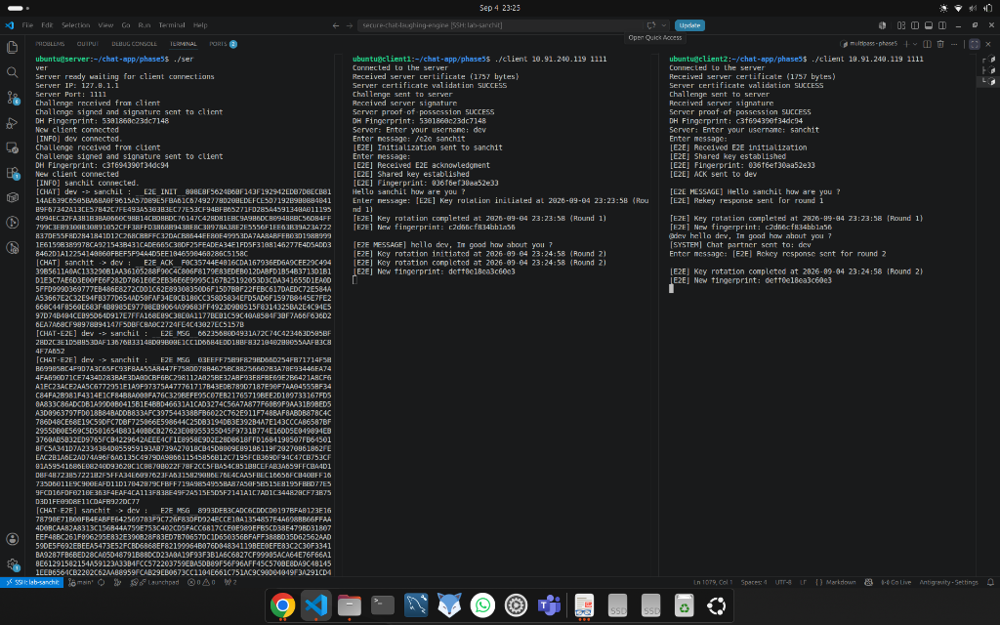

### 5.2 Post-Rotation Message Delivery

To confirm that ongoing communication was not disrupted by key rotation, a message was sent across the virtual network immediately after the Round 1 rotation completed:

* `sanchit` (on `client2` VM) sent: `"@dev hello dev, Im good how about you ?"`
* `dev` (on `client1` VM) received and decrypted: `"[E2E MESSAGE] hello dev, Im good how about you ?"`

The server log on the `server` VM confirmed that it only relayed opaque ciphertext (`[CHAT-E2E] sanchit -> dev : E2E_MSG 8993DFB3CADC6CDD...`) without accessing message content or key material.

**Figure 14 — Successful Post-Rotation Message Delivery Across VMs**

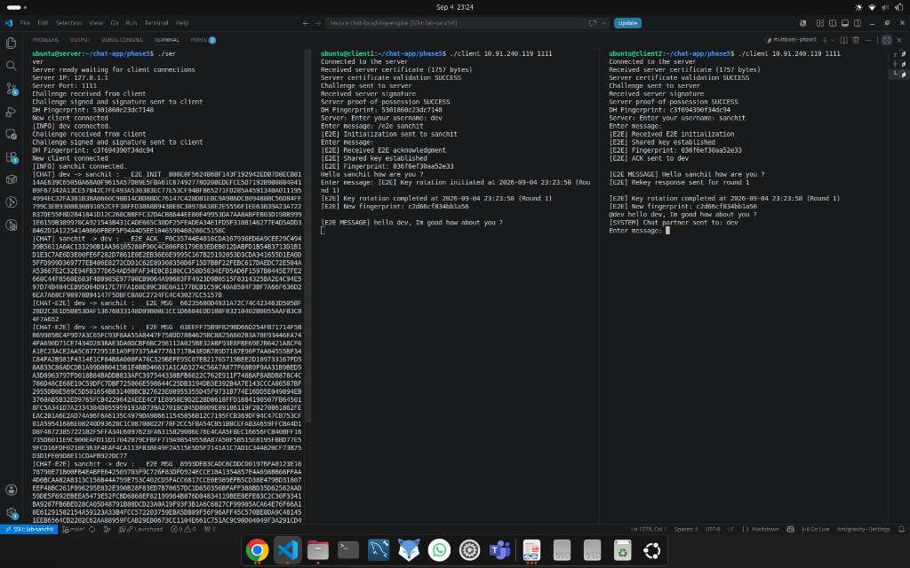

The message was decrypted without errors or dropped packets, proving that the live chat session transitions seamlessly across key boundaries over a live network.

---

## 6. Discussion: Forward Secrecy Security Properties

In terms of attacker capabilities, forward secrecy provides the following concrete security guarantees:

* **What an attacker CAN do if a key is compromised:**
  If an adversary compromises one of the endpoint machines and extracts the active symmetric key $K_i$, the adversary can only decrypt messages transmitted during that specific 60-second window.
* **What an attacker CANNOT do:**
  1. **Past Traffic (Forward Secrecy):** The adversary cannot decrypt any past messages sent using keys $K_1, K_2, \dots, K_{i-1}$. Because old keys are wiped from memory via `destroyDHE()` and each DH exchange uses fresh random exponents ($a_i, b_i$), knowing $K_i$ provides zero mathematical advantage in deriving past shared secrets.
  2. **Future Traffic (Post-Compromise Security):** Once the next 60-second rotation occurs, fresh ephemeral exponents are generated. Unless the adversary maintains persistent, continuous code execution on the host, they cannot decrypt subsequent sessions.

Phase 4 alone lacked this guarantee: a compromise of the single session key in Phase 4 exposes the entire communication history of that session. Phase 5 confines the blast radius of any key compromise to a single 60-second time slice.


# Appendix A — Generative AI Usage

Some of the prompts that were used during the development of the assignment:

### Phase 1 — Baseline Chat Application
* Explain how to implement a one-to-one chat application using TCP sockets in C++.
* Help me understand how the client and server should communicate in a TCP chat application.
* Help me fix this problem in TCP socket chat application.

### Phase 2 — Diffie–Hellman and AES-GCM
* Explain how Diffie–Hellman key exchange works and how it can be implemented using OpenSSL BIGNUM.
* Help me implement Diffie–Hellman manually using RFC 3526 Group 14 without using OpenSSL's built-in DH/ECDH APIs.
* How can I derive an AES-256 key from the Diffie–Hellman shared secret using SHA-256?
* Help me implement AES-256-GCM encryption and decryption using OpenSSL.
* Help me implement a MITM proxy to demonstrate the vulnerability in the unauthenticated Diffie–Hellman exchange.
* Help me troubleshoot AES-GCM decryption and tamper detection.

### Phase 3 — PKI and Server Authentication
* Explain how to create a Certificate Authority and issue a server certificate using OpenSSL.
* Help me implement server certificate validation in the C++ client using OpenSSL.
* How can I verify that a server possesses the private key corresponding to its certificate?
* Help me implement a challenge-response proof-of-possession mechanism using OpenSSL signatures.
* Help me update the MITM attack so that it fails against certificate validation and proof-of-possession.
* Help me troubleshoot certificate validation and signature verification errors.

### Phase 4 — End-to-End Encryption
* Explain how to modify the existing chat application to provide end-to-end encryption between clients while the server only relays encrypted messages.
* Help me implement a separate Diffie–Hellman exchange between two clients while maintaining the existing client-server encrypted connection.
* How should E2E_INIT, E2E_ACK, and E2E_MSG messages be handled?
* Help me troubleshoot why the E2E acknowledgement is not being received by the initiating client.
* Why can simultaneous E2E key exchanges cause the two clients to derive different keys?
* Review my client.cpp and identify the issue with the E2E handshake.
* Can the E2E implementation be fixed without introducing TCP message framing?

### Phase 5 — Forward Secrecy via Key Rotation
* How do I implement periodic key renegotiation in a chat application using a background timer thread?
* How to avoid collisions when both clients attempt to initiate key renegotiation at the same time?
* What is the difference between forward secrecy and break-in recovery (post-compromise security)?
* How should old keys be securely erased from memory in OpenSSL (using BN_clear and vector zeroing)?
* How to ensure that chat messages sent during or right before a key rotation are not dropped?

### Troubleshooting and Testing
* Help me troubleshoot this OpenSSL compilation error: fatal error: openssl/bn.h: No such file or directory.
* Help me troubleshoot SSH key and host-key issues on the lab machines.
* Help me understand what the Wireshark packet capture demonstrates about confidentiality.
* What evidence should I include in the report to demonstrate that the MITM attack succeeds or fails?
* Review my implementation and suggest what should be tested for each security phase.

### Report Preparation
* Help me structure the Network Security assignment report.
* Rewrite my Phase 1 implementation description in a clear technical style.
* Help me explain the security improvements between each phase.
* What screenshots and evidence should be included in the report?
* Help me write the discussion of security properties and limitations.
